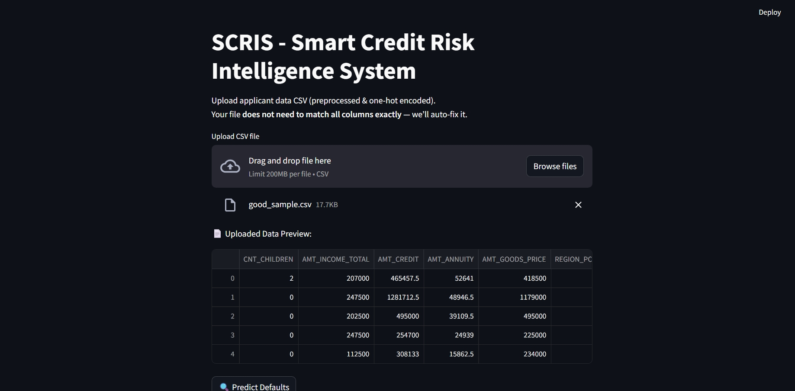
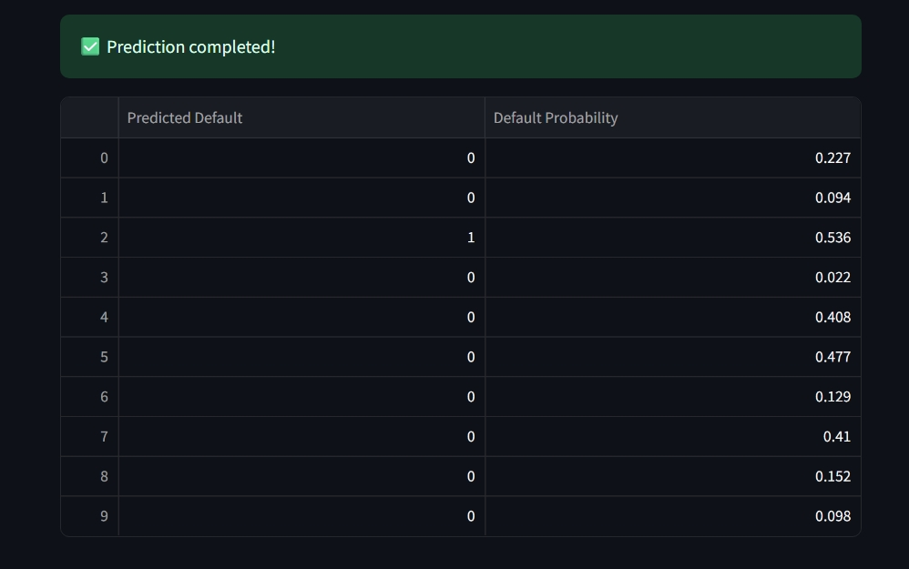
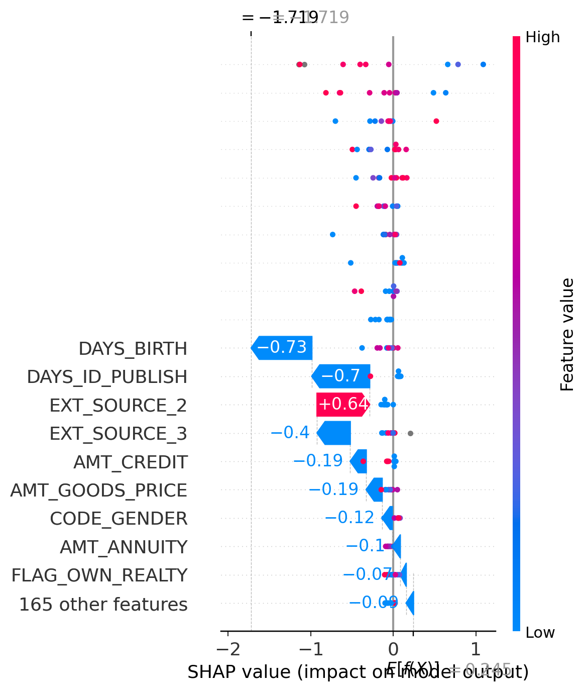

# 💳 SCRIS - Smart Credit Risk Intelligence System

**🚀 A machine learning-powered app that predicts whether a loan applicant will default or not, with SHAP-based explainability.**

---

## 📊 Problem Statement

Banks and fintech companies face major losses due to risky applicants.  
SCRIS helps them by:

- Predicting loan defaults using XGBoost
- Explaining every prediction with SHAP (feature attribution)
- Providing a web interface for easy usage (Streamlit)

---

## 📁 Dataset

- 📂 [Home Credit Default Risk – Kaggle](https://www.kaggle.com/competitions/home-credit-default-risk/data)
- We used only `application_train.csv` for simplicity and speed
- 307,000+ rows, 100+ features (post one-hot encoding)

---

## 🧠 ML Techniques Used

| Task               | Tools                         |
|--------------------|-------------------------------|
| Data Preprocessing | Pandas, One-Hot Encoding       |
| Modeling           | XGBoost                        |
| Class Imbalance    | `scale_pos_weight`             |
| Evaluation         | ROC AUC, F1 Score              |
| Explainability     | SHAP (summary + waterfall plots) |

---

## 🖥️ Streamlit App Preview

### 🔼 Upload Input CSV  


### 📊 Predictions + Probabilities  


### 🔍 SHAP Summary Plot  


### 🧠 SHAP Waterfall (Single Prediction Explanation)  


---

## 📂 File Structure

```plaintext
📦 scris-ml-app/
├── app.py                 # Streamlit web app
├── SCRIS_Model.ipynb      # Jupyter notebook for model training
├── xgb_model.pkl          # Trained XGBoost model
├── requirements.txt       # Python dependencies
├── good_sample.csv        # Sample input file
├── README.md              # Project documentation
└── screenshots/           # Folder containing images below
    ├── Streamlit.jpeg
    ├── Prediction.jpeg
    ├── shap_summary.png
    └── individual.png
```

##🚀 How to Run Locally
##🔧 Install dependencies
bash
Copy
Edit
pip install -r requirements.txt
##🖥️ Launch the app
bash
Copy
Edit
streamlit run app.py
##🧪 Upload a CSV
Use good_sample.csv (or your own file) to get predictions instantly.

##🧠 Model Explainability (SHAP)
We use SHAP to explain:

Which features made the model think an applicant is risky or safe

Why a prediction happened — even for individual customers

✅ This makes the model transparent, trustworthy, and business-ready.

💡 Why This Project?
✅ End-to-end: ML to Streamlit UI

✅ Real-world business dataset

✅ Fully explainable AI with SHAP

✅ Interview and internship-ready portfolio

##🙋‍♀️ Author
Valli Viswa Varshini M
📧 valliviswavarshini@gmail.com
🔗 [Linkedin-Valli Viswa Varshini M ](https://www.linkedin.com/in/valli-viswa-varshini-m-0947a7265/)

##📣 Like this project?
⭐️ Star this repo and share if it helped you!
